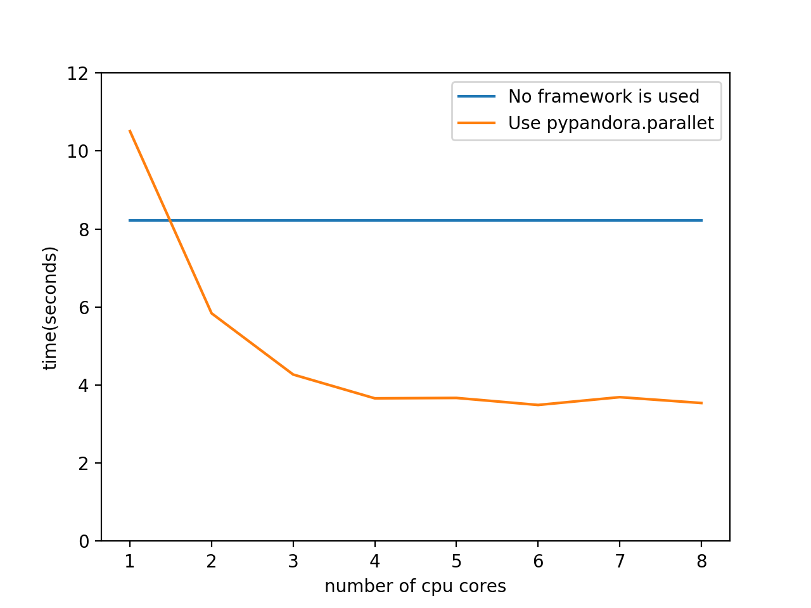
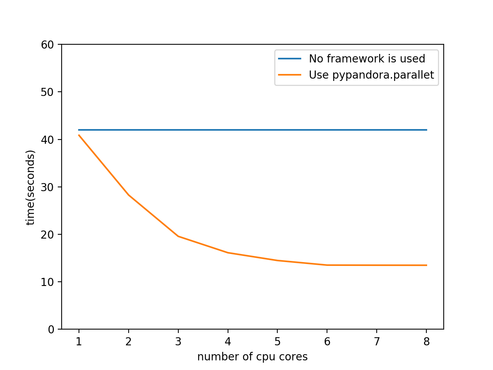

# README

**pypandora**是一个为了方便数据科学工作的python工具库。目前开源**4**个模块。

* [parallel](#parallel)，单机多核并行计算框架
* [activation](#activation)，激活函数
* [lr](#lr)，线性回归/逻辑回归
* [nn](#nn)，BP神经网络

## parallel

**pypandora.parallel**是一个单机多核并行计算框架。由于PIL的限制，CPython的多线程只能满足并发要求，无法提供多核并行服务。在一部多核心的机器上，为了提高核心利用率、减少任务运行时间，pypandora.parallel利用多进程的方式提供多核并行服务。pypandora.parallel的开发灵感源于Hadoop的MapReduce计算框架，但是对其框架进行了简化与修改，例如MapReduce中不管是Mapper还是Reducer需要花费部分算力在排序上面，而pypandora.parallel则删除了这部分；MapReduce中reduce处理函数接收的是一个形如(key, [value1, value2, ...])的参数，意为众Mapper产生的同key的value集合，而pypandora.parallel中的reduce与标准库functools.reduce的用法一致。因此，pypandora.parallel内部实现的许多概念不能与MapReduce等同。下面是统计词频的例子

### 用例

1. 函数

   最简单的做法就是直接定义map、reduce两个函数

   ```python
   import pypandora.parallel as par

   def simple_mapper(line):
       words = line.split()
       word_frq = {}
       for word in words:
           if word in word_frq:
               word_frq[word] += 1
           else:
               word_frq[word] = 1
       return word_frq

   def simple_reducer(a, b):
       for k, v in b.items():
           if k in a:
               a[k] += v
           else:
               a[k] = v
       return a

   if __name__ == "__main__":
   	print(par.run("path/to/file", simple_mapper, simple_reducer))
   ```

2. 类

   上述直接定义函数的做法在某些任务中，会由于Mapper产生中间文件时的IO操作导致运行过慢，需要引入combine减少中间结果的数据量；有时，自定义的map、reduce函数需要用到公共变量。所以，这里提供定义类来运行框架的方式

   ```python
   import pypandora.parallel as par

   def simple_mapper(line):
       words = line.split()
       word_frq = {}
       for word in words:
           if word in word_frq:
               word_frq[word] += 1
           else:
               word_frq[word] = 1
       return word_frq

   def simple_reducer(a, b):
       for k, v in b.items():
           if k in a:
               a[k] += v
           else:
               a[k] = v
       return a

   class SimpleMapper(par.Mapper):
       def map(self, line):
           return simple_mapper(line)
       def combine(self, a, b):
           return simple_reducer(a, b)

   class SimpleReducer(par.Reducer):
       def reduce(self, a, b):
           return simple_reducer(a, b)

   if __name__ == "__main__":
   	print(par.run("path/to/file", SimpleMapper(), SimpleReducer()))
   ```

3. 文件输出

   如果任务目的是将各行经map函数处理后写入一个文件，可考虑使用SimpleFileReducer类，可以有效防止最终结果占用内存过多的问题，并且节省任务时间。以分词任务举例

   ```python
   import pypandora.parallel as par
   import jieba

   def map(line):
       return ' '.join(list(jieba.cut(line)))

   if __name__ == "__main__":
       par.run("path/to/infile", map, par.SimpleFileReducer("path/to/outfile"))
   ```

### 测试1

为了得知该框架的性能，统计在不同核心数情况下wordcount任务的时间，并与没有使用框架的用时进行对比

> * 环境
>
>   系统：OS X EI Capitan，10.11.6
>
>   CPU：2.2 GHz Intel Core i7，四核心八线程
>
>   内存：16 GB 1600 MHz DDR3
>
>   磁盘：APPLE SSD SM0256G
>
>   Python版本：3.6.2
>
>   测试文件：《飘》英文版（扩充40倍，约100M）
>



### 测试2

实际场景中的任务——对语料进行中文分词，属于计算密集型任务，且行与行之间的结果相互无影响

> * 环境
>
>   测试文件：语料文件（约30M，一行一篇中文文章）
>
>   其余条件同上
>



## activation

**pypandora.activation**是一个激活函数模块，其中包含了各种激活函数及其求导的实现

### 用例

1. 静态方法

   调用静态方法，直接使用forward、backward

   ```python
   form pypandora.activation import Sigmoid

   x = 0.5
   y = Sigmoid.forward(x)
   g = Sigmoid.backward(y)
   ```

2. 实例化

   实例化激活函数类，调用auto_forward计算结果并作为类成员保存，随后不输入参数即可调用auto_backward执行求导过程

   ```python
   from pypandora.activation import Sigmoid

   sigmoid = Sigmoid()
   x = 0.5
   y = Sigmoid.auto_forward(x)
   g = Sigmoid.auto_backward()
   ```

## lr

**pypandora.lr**是一个机器学习算法模块，包含了线性回归、逻辑回归的实现

### 用例

1. 训练与预测

   ```python
   from pypandora.lr import LinearRegression
   import numpy as np

   xs = np.array([[i] for i in range(100)])
   ys = np.array([10*x[0]+10+10*random.random() for x in xs])

   model = lr.LinearRegression()
   model.train(xs, ys)
   model.predict([1])
   ```

2. 保存与加载

   ```python
   model.save("path/to/file")
   model.load("path/to/file")
   ```


## nn

**pypandora.nn**是一个机器学习算法模块，包含了BP神经网络的基本实现。该模块使用Sequential mode进行模型训练，支持保存、加载模型

### 用例

1. 训练

   以下代码建立了一个双输入单输出的BP神经网络，具有一层隐含层(含两个神经元，激活函数为Sigmoid)，实现了“与”逻辑

   ```python
   from pypandora.nn import BP
   from activation import Sigmoid

   xs = [(0, 0), (0, 1), (1, 0), (1, 1)]
   ys = [(0), (0), (0), (1)]

   nn = BP(in_num=2)
   nn.add_layer(2, ac_func=Sigmoid)
   nn.add_layer(1, ac_func=Sigmoid)
   nn.train(xs, ys, learning_rate=1.7, iteration=10000, log_step=64)
   ```

2. 保存

   为训练好的模型进行保存操作

   ```python
   p = nn.save("paht/to/file")
   print("The trained model is saved in: %s" % p)
   ```

3. 加载与预测

   加载存储于文件中的模型参数，并进行结果预测

   ```python
   nn = BP()
   nn.load("path/to/file")
   nn.predict((1, 1))
   ```

   ​